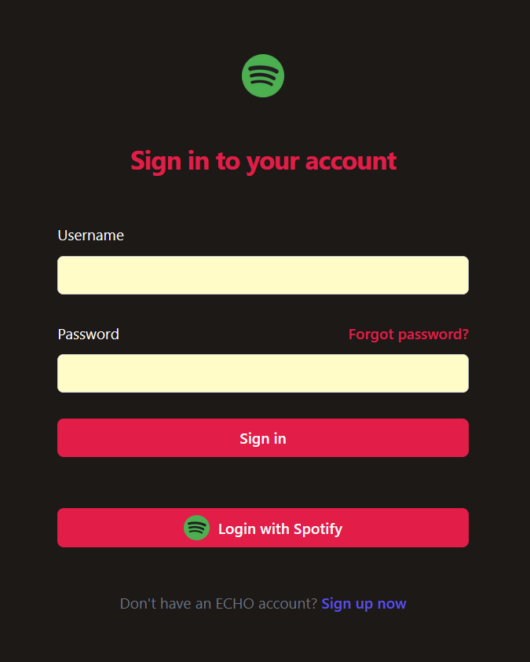
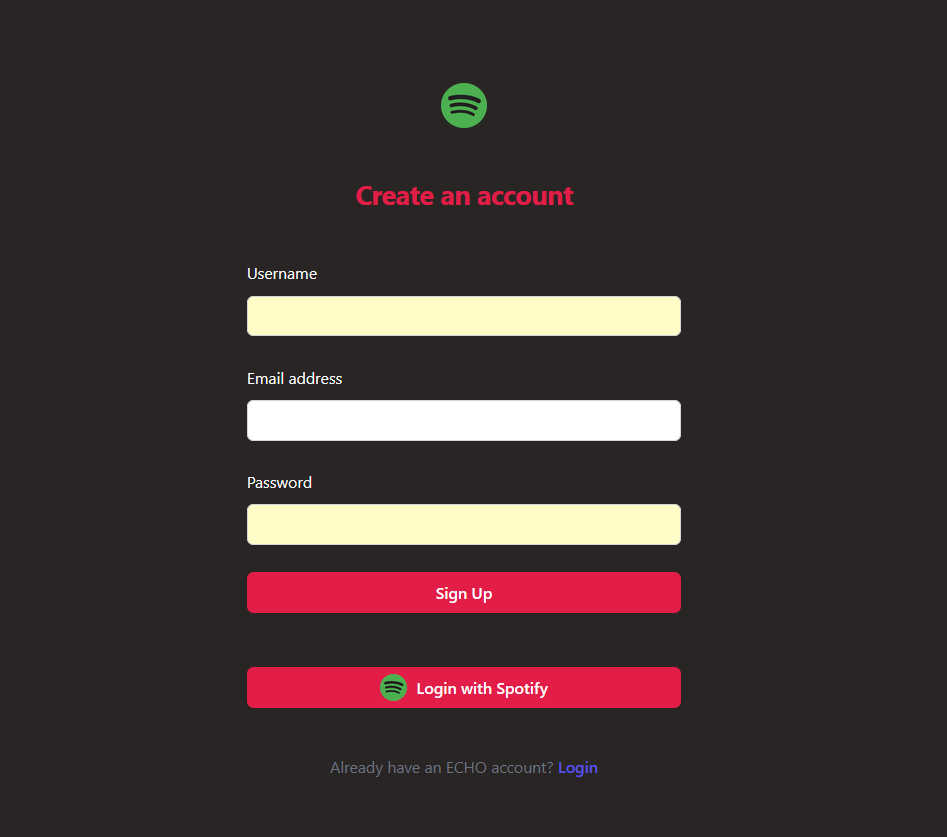
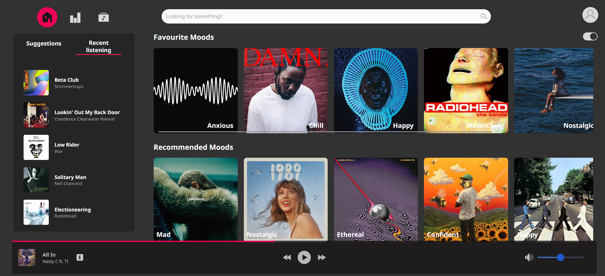
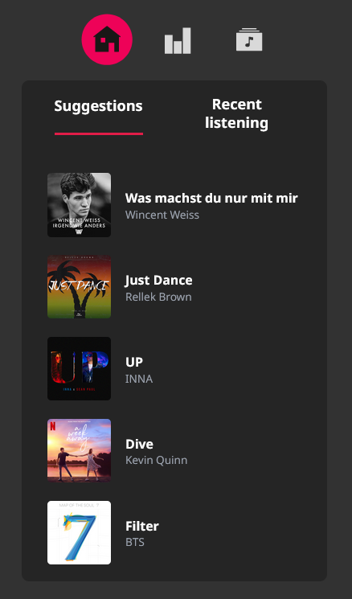
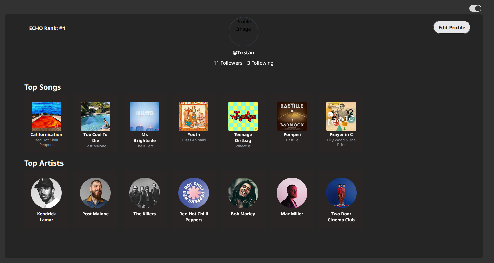
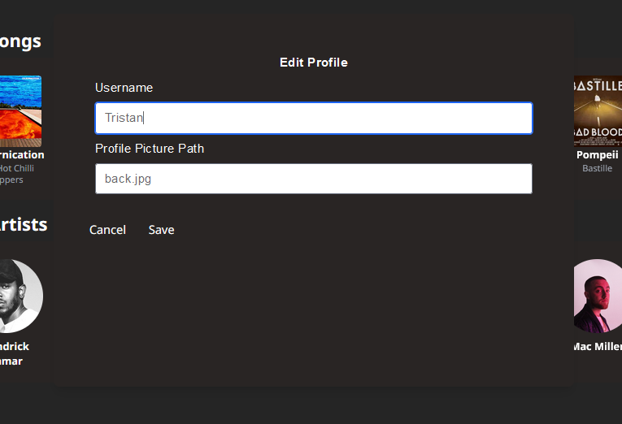

# ECHO Progressive Web App User Manual

## Table of Contents
1. [Introduction](#introduction)
2. [Getting Started](#getting-started)
    - [System Requirements](#system-requirements)
    - [Installation](#installation)
3. [User Registration and Login](#user-registration-and-login)
    - [Login](#login)
    - [Resetting Your Password](#resetting-your-password)
    - [Creating a New Account](#creating-a-new-account)
4. [Using the Application](#using-the-application)
    - [Navigating the Interface](#navigating-the-interface)
    - [Viewing Your Music Library](#viewing-your-music-library)
    - [Following Users and Artists](#following-users-and-artists)
    - [Searching and Discovering Music](#searching-and-discovering-music)
    - [Playing Music](#playing-music)
    - [Changing from Dark to Light Mode](#changing-from-dark-to-light-mode)
5. [Suggestions](#suggestions)
6. [Insights](#insights)
7. [Library](#library)
8. [Editing Your Profile](#editing-your-profile)
9. [Support](#support)
    - [Frequently Asked Questions](#frequently-asked-questions)
    - [Contact Support](#contact-support)

## Introduction
Welcome to the ECHO Progressive Web App! This user manual will guide you through the features and functionalities of the application to help you get the most out of your music experience.

## Getting Started

### System Requirements
- **Operating Systems:** Windows, macOS, iOS, Android
- **Browsers:** Chrome, Firefox, Safari, Edge
- **Internet Connection:** Required for initial setup and streaming

### Installation
1. Open your web browser and navigate to the ECHO PWA website.
2. Follow the on-screen instructions to install the PWA on your device.

## User Registration and Login

### Login
Upon first accessing our app you should be presented with this login page:

To log in with an existing account:
1. Enter your Username in the text field underneth the 'Username' Label.
2. Enter your Password in the text field underneth the 'Password' Label.
3. Click the 'Sign In' Button.

To log in using Spotify:
1. Click on the 'Login with Spotify' button.
2. Follow the on screen prompts.

### Resetting Your Password
1. Click on the "Forgot Password" link on the login page.
2. Enter your registered email address.
3. Follow the instructions sent to your email to reset your password.

### Creating a new account
To create a new account, click the link highlighted in blue 'Sign Up now'.

You should be presented with the following page:

1. Enter a new username in the text field under the 'Username' label.
2. Enter a valid email address in the text field under the 'Email address' label.
3. Enter a password in the text field under the 'Password' label.
4. Click the button labeled 'Sign Up'.

Alternatively, you can click the 'Login with Spotify' Button. This will automate most of the steps.

## Using the Application

### Navigating the Interface
- **Home:** (The House Icon) View your personalized dashboard.
- **Library:** (The folder with a note on it) Access your music library and playlists.
- **Search:** (The search bar at center top of the screen) Find new music and artists.
- **Profile:** (Icon at the top right of the screen) View and edit your profile information.
- **Insights:** (Bars icon between the house icon and the music folder icon) View your listening habits in the form of data visualisations.

### Viewing Your Music Library
1. Go to the "Library" section.
2. Browse through your saved songs, albums, and playlists.

### Following Users and Artists
1. Go to a user's or artist's profile.
2. Click on the "Follow" button to start following them.

### Searching and Discovering Music
1. Navigate to the "Search" section.
2. Enter the name of a song, artist, or album.
3. Browse through the search results to find new music.

### Playing Music
1. Select a song from your library or search results.
2. Click the "Play" button to start playing the music.

### Changing from dark to light mode
1. Click the switch on the top right hand corner of the window.

## Suggestions
This tab is located beneath the Home tab, and is based off your most recent listening. To play any of the suggested songs, click on the album cover and it should begin to play through Echo shortly.

## Insights
This is the bar icon between the house and the music folder.

## Library
This is the music file icon to the right of the bar and house.

## Editing your profile
To view your profile, click on the icon on the top right side of the page. This should appear either as an individual's silhouette or your profile picture.

A menu similar to this should appear:

To edit your username or user icon, click 'Edit your profile'.

The following popup should appear.

Enter your new username or the path to your new profile picture in the fields below. Then click Save.

Alternatively, you can click Cancel to abort the operation.

## Support

### Frequently Asked Questions
1. Navigate to the "Support" section.
2. Browse through the list of FAQs for common issues and solutions.

### Contact Support
1. Go to the "Support" section.
2. Click on "Contact Us" to get in touch with the support team.
3. Fill out the support form with your issue and contact details.
4. Submit the form to receive assistance from the support team.
